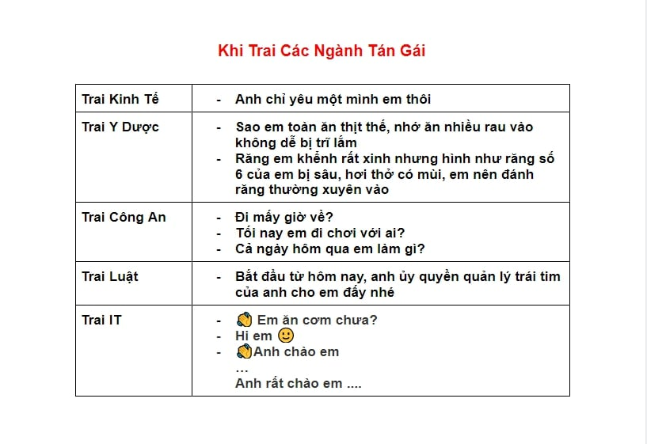

# **Report**

## **18/11/2020**

1. ### Markdown
2. ### Markdown to PDF
3. ### http://www.tianfucup.com/

# Tạo file tài liệu pdf từ Markdown
1. Ai có thể viết kiểu này
2. Tại sao viết bằng markdown
3. Những tình huống sử dụng
4. Làm sao để tạo được file pdf từ markdown

## 1. Ai có thể viết kiểu này
- Bất cứ ai cũng có thể viết được, chỉ cần biết cú pháp Markdown (cực kỳ đơn giản)
- Nhanh, gọn, lẹ, ngon, bổ, rẻ